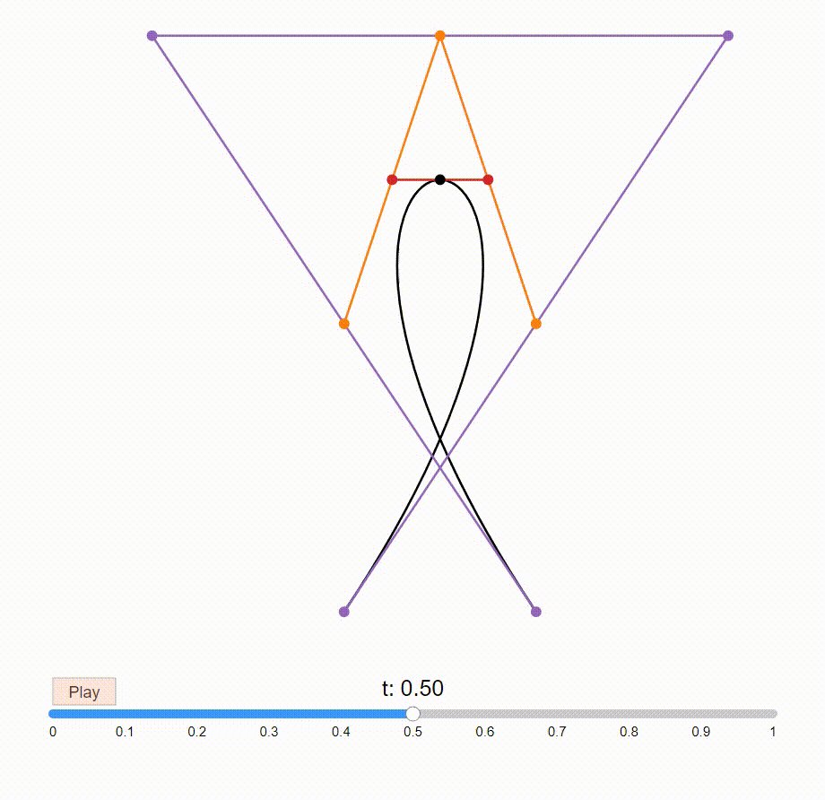

# Beziervizer

Beziervizer is an R package for plotting interactive Bézier curves. Users can move the control points of plotted result at will and the curve will transform accordingly. There will be some functions to demonstrate the properties of Bézier curves in an interactive way.

## Installation

Install the package from GitHub as follows:

```r
devtools::install_github("ZiyanXiong/Beziervizer", build_vignettes = TRUE)
```

## Example of interactive Bézier curves

Users can use their own control points to initialize the Bézier curves. The function `plot_cubic_bezier()` accepts dataframe and matrix as input.Here is a dataframe input example below.

```r
#Plot a bezier curve with a dataframe as control points
x = c(200, 400, 100, 300)
y = c(500, 300, 300, 500)
control_points = data.frame(x,y)
plot_cubic_bezier(control_points)
```

The gif above shows how the interactive plot looks like and what users can do with it.
Users can try out these interactive plots in the [vignette](./vignettes/Beziervizer.html) or install this package and test them in Rstudio.
